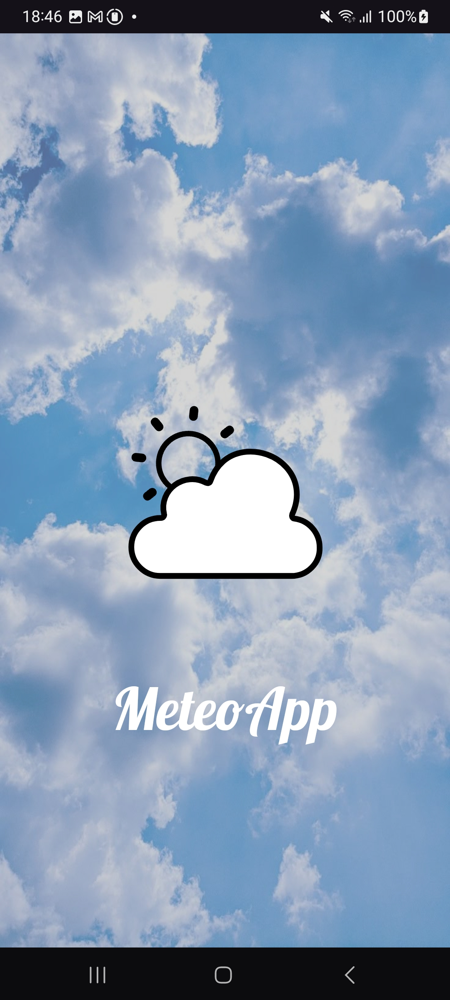
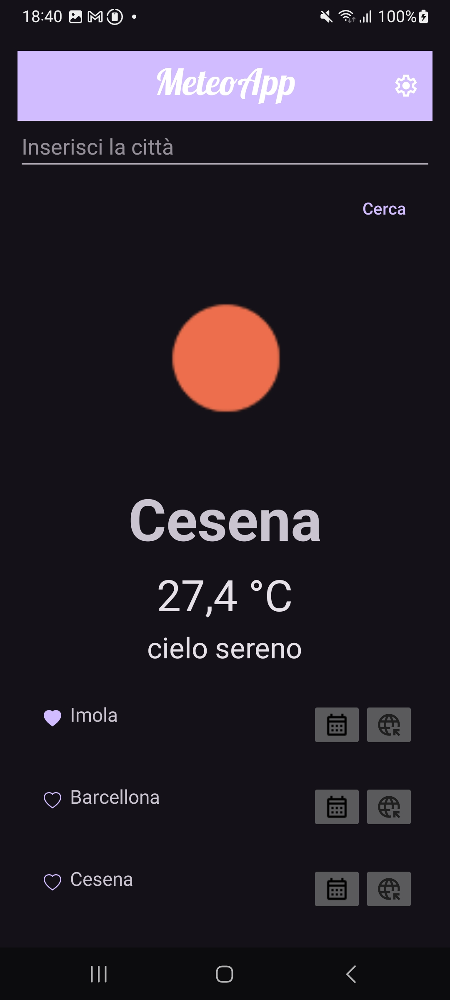
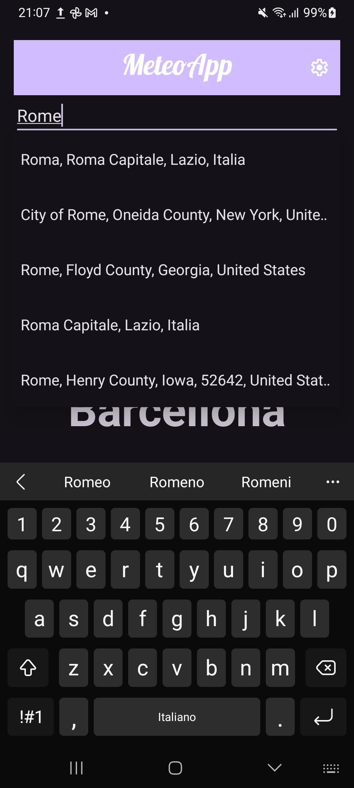
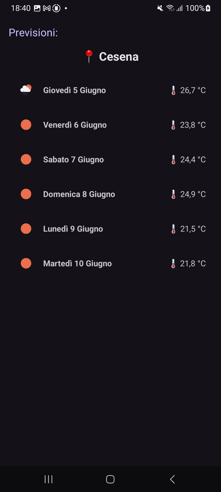
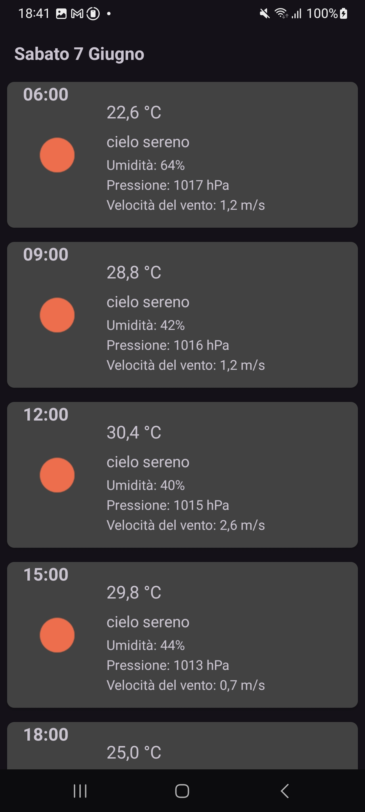

   

## Project for: Laboratorio di Programmazione di Sistemi Mobili  

## Idea  
The idea behind this weather app is to provide users with quick and easy access to accurate weather information.  

## What the App can do  
- View the current weather and a 5-day forecast for any selected city.

- Save searched cities automatically for easy access later.

- Mark favorite cities to keep them always visible at the top of the search history on the main screen.

- View the location of each saved city on an interactive map.

-  Show temperatures in Celsius and Fahrenheit.

## Features and Future Improvements  
- Enhanced user experience with smooth animations and visual feedback.

- Local caching of weather data to provide offline access and reduce API calls.

- Added automated tests to increase application robustness.

- Implemented map integration with Google Maps API
  
## Homepage  
  

## Search bar
  

## Daily Forecast  
   

## Hourly Detailed Forecast
   
